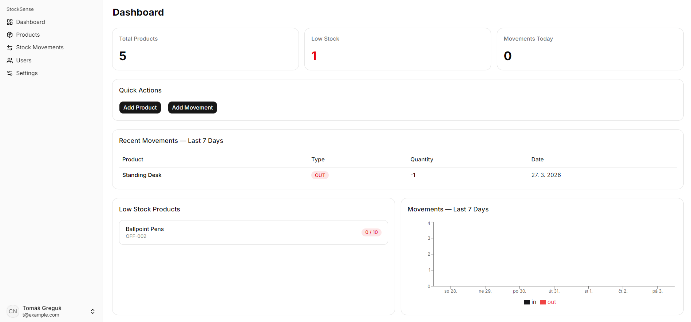
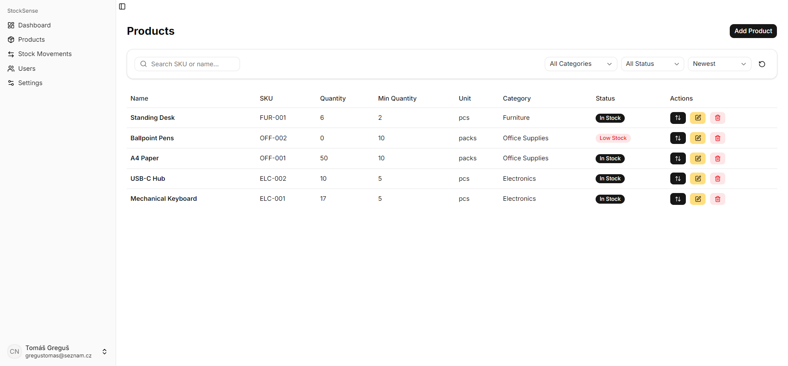
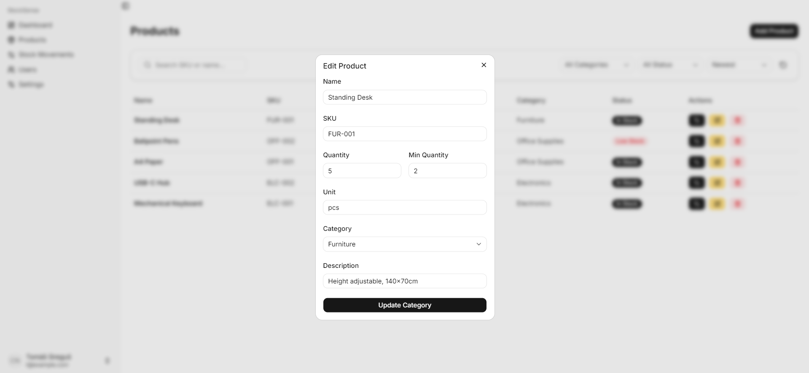
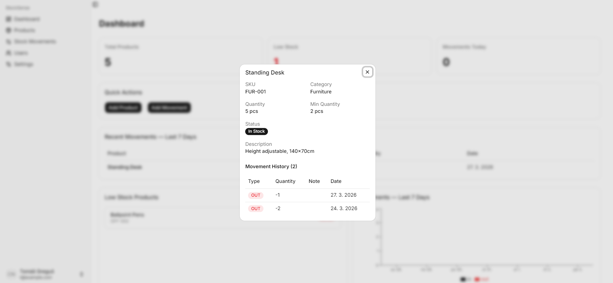
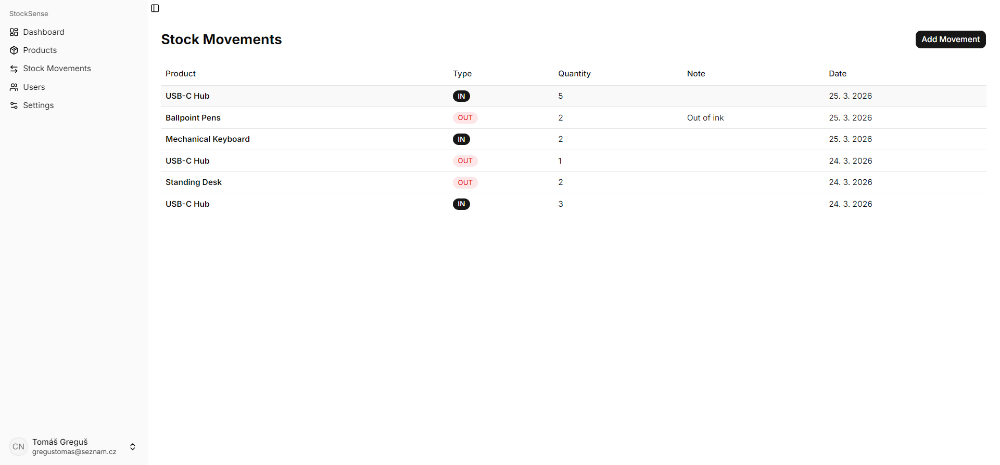
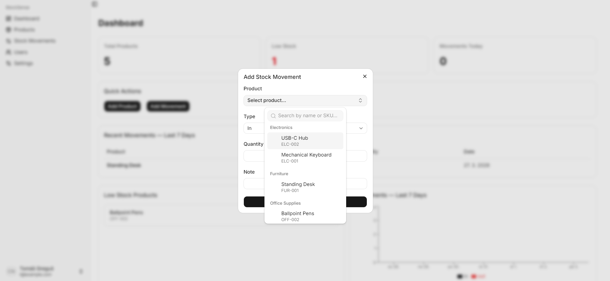
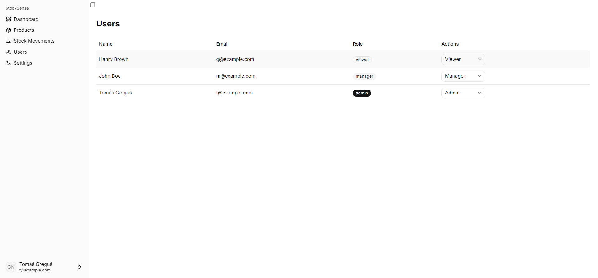
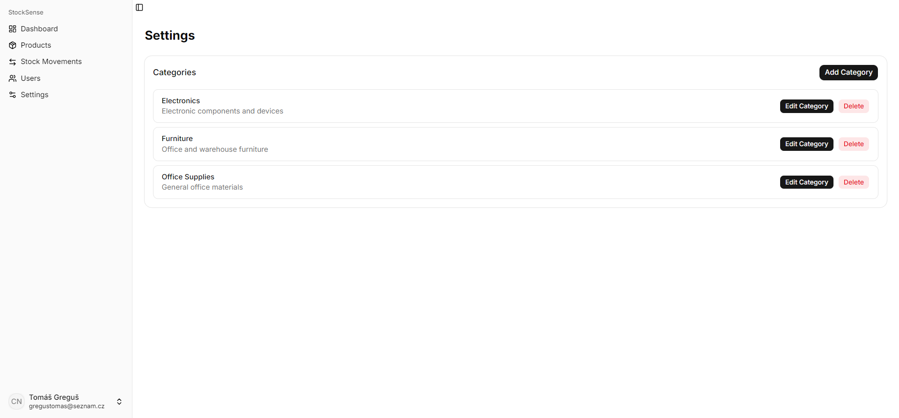

# StockSense

Real-time inventory management system built with Next.js, TypeScript and Firebase.

🔗 **[Live Demo](https://stock-sense-tau.vercel.app/)**

---

## Dashboard



Live stats — total products, low stock count and today's movements. Recent movements table (last 7 days) with pagination, low stock product list and a bar chart showing in/out activity over the past week. Quick actions for adding a product or movement directly from the dashboard.

---

## Products

<table>
  <tr>
    <td width="50%"></td>
    <td width="50%"></td>
  </tr>
  <tr>
    <td><sub>Product list with search, category filter, status filter and sorting.</sub></td>
    <td><sub>Edit modal — name, SKU, quantity, min quantity, unit, category and description.</sub></td>
  </tr>
</table>

<table>
  <tr>
    <td width="50%"></td>
    <td width="50%"></td>
  </tr>
  <tr>
    <td><sub>Product detail modal with full movement history.</sub></td>
    <td></td>
  </tr>
</table>

Add, edit and delete products with SKU, category, unit and minimum quantity. Low stock badge shown automatically when quantity drops below the minimum.

---

## Stock Movements

<table>
  <tr>
    <td width="50%"></td>
    <td width="50%"></td>
  </tr>
  <tr>
    <td><sub>Full movement history with IN/OUT badges, quantity, note and date.</sub></td>
    <td><sub>Add movement modal — product combobox with search and category grouping.</sub></td>
  </tr>
</table>

Record stock in/out with quantity and an optional note. Movements and product quantity are updated atomically. Out movement is blocked when quantity is 0.

---

## Users & Settings

<table>
  <tr>
    <td width="50%"></td>
    <td width="50%"></td>
  </tr>
  <tr>
    <td><sub>User list with role assignment — Admin, Manager, Viewer.</sub></td>
    <td><sub>Category management — add, edit and delete.</sub></td>
  </tr>
</table>

---

## Role Permissions

| Feature                  | Admin | Manager | Viewer |
| ------------------------ | ----- | ------- | ------ |
| View dashboard           | ✅    | ✅      | ✅     |
| View products            | ✅    | ✅      | ✅     |
| Add/Edit/Delete products | ✅    | ✅      | ❌     |
| View movements           | ✅    | ✅      | ✅     |
| Add movements            | ✅    | ✅      | ❌     |
| Manage categories        | ✅    | ❌      | ❌     |
| Manage users             | ✅    | ❌      | ❌     |

---

## Tech Stack

- **Framework** — Next.js 15 (App Router)
- **Language** — TypeScript (strict mode)
- **Database** — Firebase Firestore (real-time)
- **Auth** — Firebase Authentication
- **Styling** — Tailwind CSS + shadcn/ui
- **Validation** — Zod + React Hook Form
- **Animations** — Framer Motion
- **Charts** — Recharts

---

## Local Development

```bash
git clone https://github.com/gregustomas/StockSense.git
cd stock-sense
npm install
```

Create `.env.local`:

```
NEXT_PUBLIC_FIREBASE_API_KEY=
NEXT_PUBLIC_FIREBASE_AUTH_DOMAIN=
NEXT_PUBLIC_FIREBASE_PROJECT_ID=
NEXT_PUBLIC_FIREBASE_STORAGE_BUCKET=
NEXT_PUBLIC_FIREBASE_MESSAGING_SENDER_ID=
NEXT_PUBLIC_FIREBASE_APP_ID=
```

```bash
npm run dev
```

---

Built by [Tomáš Greguš](https://github.com/gregustomas)